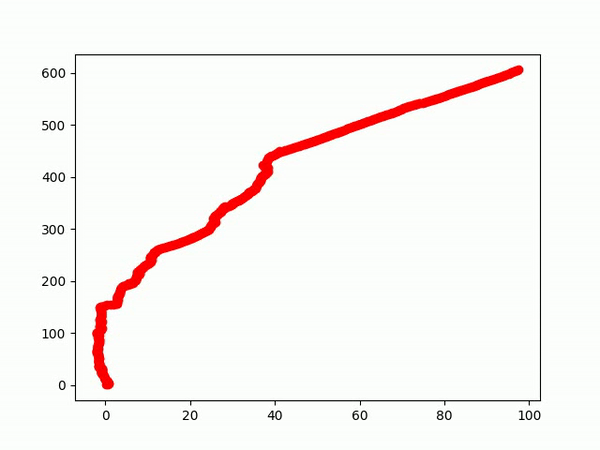
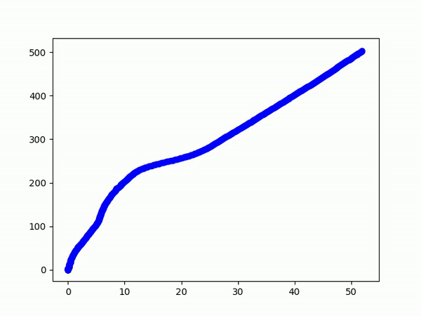

# visual-odometry-sfm
This is the repository for the project - Camera pose tracking using visual odometry
### ---------- Our Implementation ---------------------------------------- Opencv Implementation -----------
 
### Video with camera mounted on the car

## System and library requirements.
 - Python3
 - Numpy
 - cv2
 - math
 - glob
 - matplotlib
 
## How to Run
1. Clone this repo or extract the "nalindas_proj_5.zip" file.  
2. Navigate to the folder "Code"  
3. Inside the python script - `DataPreprocess.py`, you need to specify the appropriate original dataset path in the `file_path` variable. Next, you need to specify the appropriate camera model parameters path in the `camera_path` variable. Finally, you need to specify the path where you want the processed undistorted images to be saved in the `write_path` variable. 
4. Inside the python script - `main.py`, you need to specify the processed undistorted dataset path which you had specified in `DataPreprocess.py` in the `path` variable. Next, you need to specify the appropriate camera model parameters path in the `camera_path` variable. Finally, you need to specify the path where you want the camera pose plot images to be saved in the `save_path` variable. 
5. In the terminal, run the command `python main.py` to run our implementation. Run the command `python builtin_main.py` to run the opencv implementation. (You need to specify the appropriate original dataset path in the `IMAGES_PATH` variable. Finally, you need to specify the path where you want the camera pose plot images to be saved in the `MODELS_PATH` variable.)

